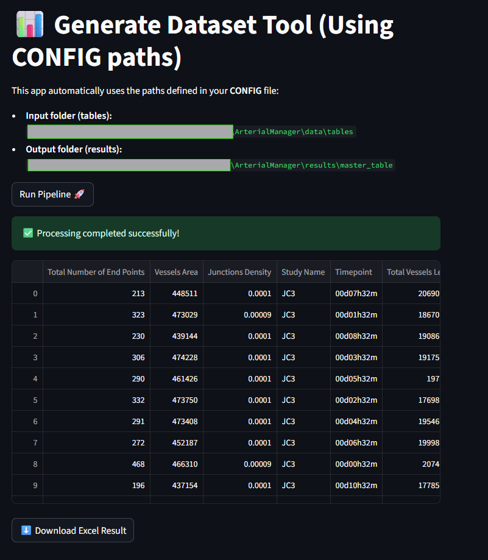
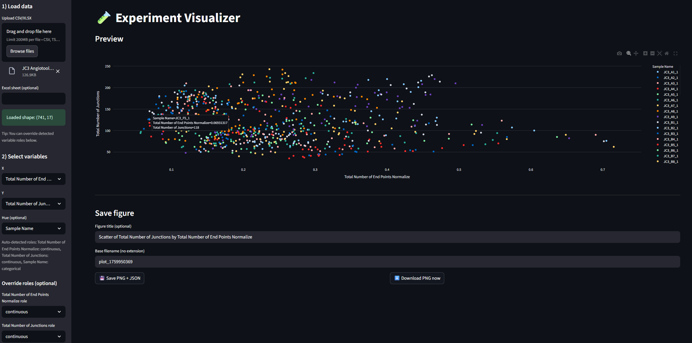

# ArterialManager

📊 **ArterialManager** is a Python-based toolkit for **angiogenesis research data processing**.
It includes three complementary pipelines:

1. **Table Manager** → merges, normalizes, and formats **Angiotool**, **Cell Count**, and **Sample** Excel files into a clean master dataset.
2. **Streamlit Visualizer** → Uses the results from 'Table Manager' and generates a plot for visualization 
3. **Vessel Overlap Analysis** → performs **intensity-weighted and binary colocalization analysis** of red and green vessel networks from microscopy images.

All pipelines can be run via scripts with Streamlit apps and Minerva Super Computer

---

## 🚀 Features

### 📊 Table Manager

* Automatically detects and loads input Excel tables:

  * **Angiotool** output
  * **Cell count** table
  * **Sample metadata**
* Cleans and reformats headers
* Normalizes vessel metrics by cell count
* Produces a styled **Excel master table** with frozen headers


### 📈 Table Visualizer
* Generate plots with the use of the 

### 🧬 Vessel Overlap Analysis

* Preprocesses microscopy images:

  * **Wavelet-based background & noise subtraction (WBNS)**
  * **Frangi vesselness enhancement**
  * **Skeletonization of vessel structures**
* Computes both:

  * **Intensity-based overlap** (Manders, Pearson, Dice, Jaccard on weighted signals)
  * **Binary overlap** (pure intersection of vessel masks)
* Generates high-quality **visual overlays**:

  * Green channel, red channel, and yellow overlap highlights
  * Exported per-cell and summarized into a global CSV/Excel table

---

## 🏗 Project Structure

```
ArterialManager/
├── config/
│   └── config.py                # Centralized path configuration
├── library/
│   ├── TableCreator/
│   │   └── generate_tab_dataset.py   # Core table pipeline
│   └── ImageOverlap/
│       └── overlap_images.py        # entry point of the library, wrapper functions
│       └── wavelet_overlap.py        # Vessel overlap analysis
├── src/
│   ├── app_streamlit.py          # Streamlit app for table pipeline
│   ├── app_plot.py               # Streamlit app for interactive plots
│   └── run_overlap.py            # CLI script for vessel overlap analysis
│   └── download_from_drive.py    # download images from google drive private to local computer 
├── data/
│   ├── tables/                   # Input Excel tables
│   └── imgs/                     # Input microscopy images (C=0 green, C=1 red)
├── results/
│   ├── master_table/             # Processed tables
│   └── overlap_images/           # Processed overlays + metrics
├── compute_vessel_overlap.yml    # Call to comptue the image overlap code
├── environment.yml               # Conda environment definition
└── README.md                     # Project documentation
```

---

## ⚙️ Installation

1. Clone the repository:

   ```bash
   git clone <your_repo_url>
   cd ArterialManager
   ```

2. Create the environment:

   ```bash
   conda env create -f environment.yml
   conda activate arterial_manager
   ```

---


## 1. Run the Table Manager (Excel processing) ▶️ 
<p align="center">
  
</p>

**Output example**: 
```
<StudyName> Angiotools Formated <timestamp>.xlsx
```


**Streamlit Web App**:

```bash
streamlit run src/app_streamlit.py
```

**Tkinter Desktop App**:

```bash
python src/app_tkinter.py
```

Inputs: `data/tables/`
Outputs: `results/master_table/`

---

## 2. Run the Table Visualizer  ▶️ 
<p align="center">
  
</p>
**Streamlit Web App Visualizer**:

```bash
streamlit run src/app_plot.py
```

**Tkinter Desktop App**:

```bash
python src/app_tkinter.py
```

Inputs: `data/tables/`
Outputs: `results/master_table/`

---

## 3. Run the Vessel Overlap Analysis  ▶️
<p align="center">
  
</p>

* RGB overlays (green + red + yellow highlights)
* Heatmaps of intensity overlap
* Binary overlap masks
* Metrics (Manders, Pearson, Dice, Jaccard)

**Python script (local):**

```bash
bsub < minerva/run_compute_vessel_overlap.sh
```

**Python script (Minerva):**
```bash
python compute_vessel_overlap.py
```


* Input images must follow the convention:

  * `*_C=0.jpg` → green channel
  * `*_C=1.jpg` → red channel
  * Excludes `MERGE` and `jpgscale` files


* Generate the output per cell: 
* <cell_id>_components.pkl.gz : masks and binary files 
* <cell_id>_grid_images.png: image with all the grid
* <cell_id>_metrics.xlsx: computed metrics of overlap
* <cell_id>_overlay_green_red.png: green image with red and colors
* <cell_id>_overlay_green_red_binary.png: binary map of the overlay


## 4. Visualize Results   ▶️
Once the images are generated at different filters and intensity we can now visualize them in an overlap modality. 

Double-click or right-click → Open With → Chrome/Edge/Firefox, the file 
```bash 
src/app_overlay_compare.html
```

This will give you a display to select the folder source with all the images you want to compare and a selection to overlay
<p align="center">
  
</p>

You can move the bars to select how much you want to visualize per image and select an opacity level. 

The image can be saved as png and a metadata with the levels and separate images path for reproducibility. 


## 👤 Author

**Giorgio Ricciardiello Mejia**
📧 [giorgio.ricciardiellomejia@mountsinai.edu](mailto:giorgio.ricciardiellomejia@mountsinai.edu)

